# Diagramas de flujo

Vista **de muy alto nivel** del backend API UDEC Cereté: qué puede hacer hoy la API, cómo interactúan clientes y servicios, y qué queda por conectar.

**Actualizado:** 2026-08-28

> **Leyenda:** líneas y nodos **continuos** = implementado en código. Líneas **punteadas** = diseño acordado o parcial (falta credencial, deploy o integración cloud).

---

## 1. Contexto del sistema

Cuatro clientes (repos aparte) consumen un único contrato REST `/api/v1`. La API no sirve HTML estático ni archivos grandes en el cuerpo de la respuesta.

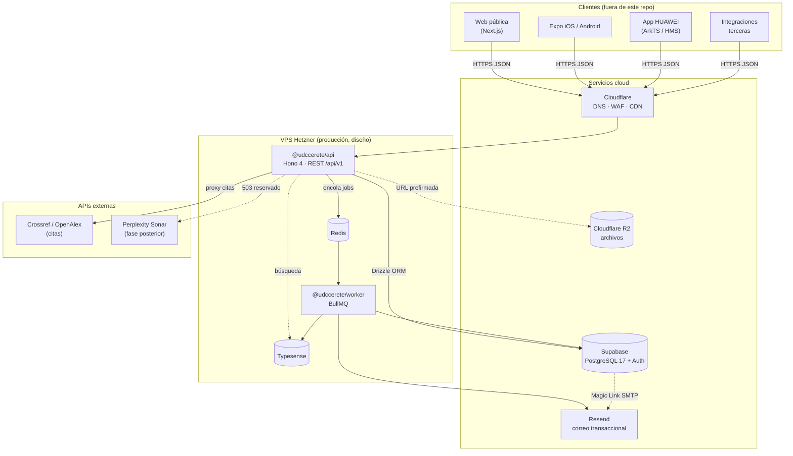

---

## 2. Cliente ↔ servidor (petición REST típica)

Toda respuesta JSON sigue el sobre `{ data, meta }` o `{ error, meta }`. Excepciones: `/feed.xml` y `/api/v1/calendar.ics`.

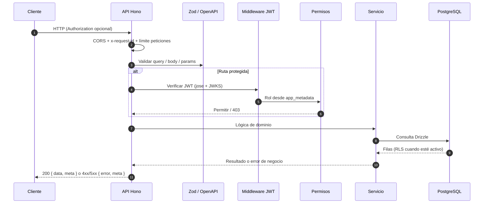

---

## 3. Acceso e identidad (Magic Link, Google OAuth + JWT)

La API expone proxy `/api/v1/auth/*` y también acepta tokens obtenidos directamente con `@supabase/supabase-js`. Supabase Auth emite el token; la API **valida la firma** (JWKS) y aplica permisos. RLS en PostgreSQL cuando está aplicado en cloud.

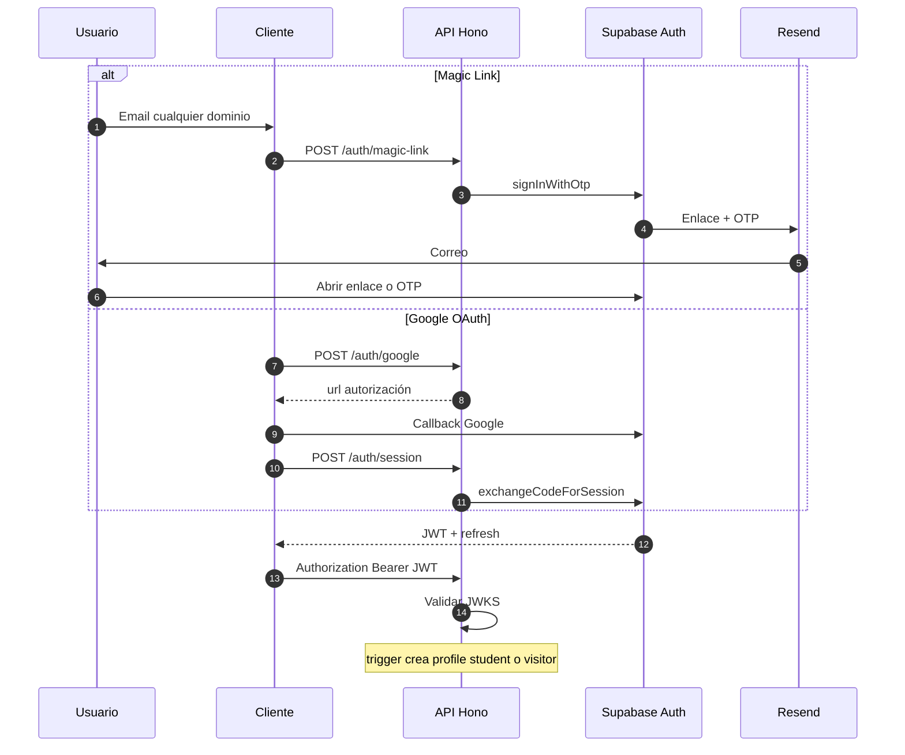

---

## 4. Capas de autorización

Doble barrera: permisos en la API y políticas en la base.

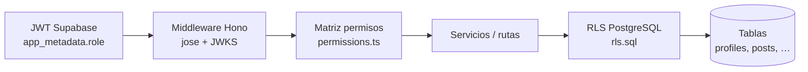

| Rol | Alcance (alto nivel) |
|-----|---------------------|
| `visitor` | Lectura pública |
| `student` | Lectura + participación institucional |
| `teacher` | Recursos y perfil docente |
| `editor` | Contenido asignado |
| `admin` | Su centro tutorial |
| `super_admin` | Sistema completo |

Detalle: [Autenticación](./auth.md).

---

## 5. Flujos de datos por dominio

Qué puede hacer la API **hoy**, agrupado por nivel de acceso. Las capas se leen **de arriba abajo** (de menor a mayor privilegio); todas convergen en la misma API.

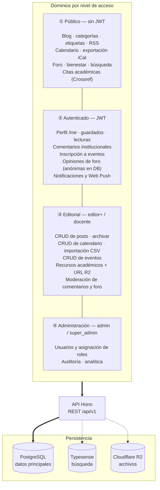

Las líneas entre capas (`---`) solo ordenan la lectura; no implican un flujo secuencial. Las líneas punteadas hacia Typesense y R2 indican integraciones opcionales (degradación sin credenciales).

Catálogo completo: [Referencia de la API](../api/README.md).

---

## 6. Búsqueda y degradación

Si Typesense no está disponible, la API intenta una alternativa SQL y avisa al cliente.

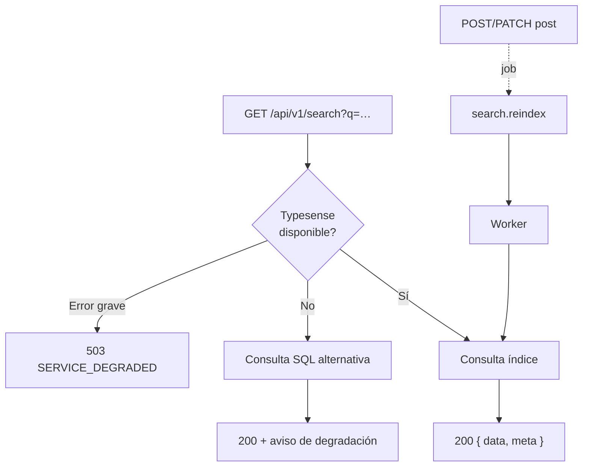

---

## 7. Archivos (recursos académicos)

Los binarios no pasan por el cuerpo de la API; solo metadatos y URLs prefirmadas.

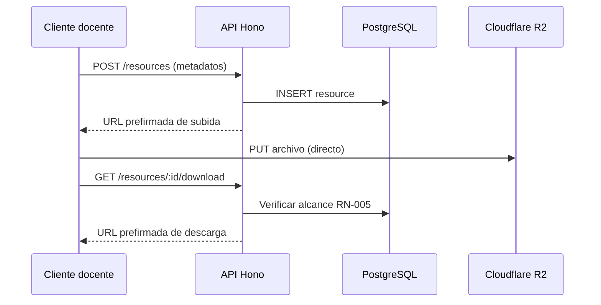

---

## 8. Trabajo asíncrono (colas)

La API encola y responde rápido; el worker procesa en segundo plano. Sin `REDIS_URL`, la cola es no-op (solo log en desarrollo).

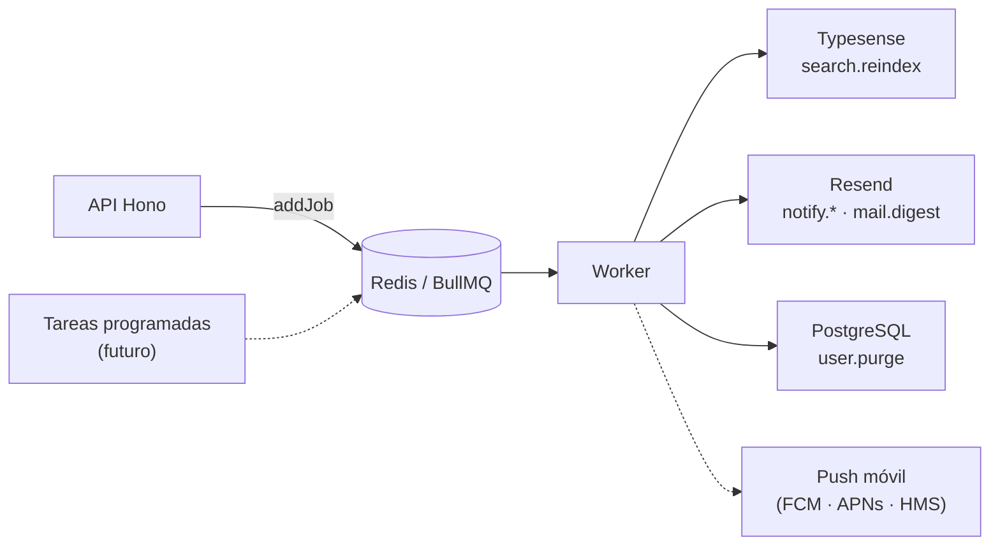

Colas implementadas: [Trabajo asíncrono](./async.md).

---

## 9. Monorepo y contratos

Un esquema Zod alimenta validación, tipos TypeScript y OpenAPI en `/doc`.

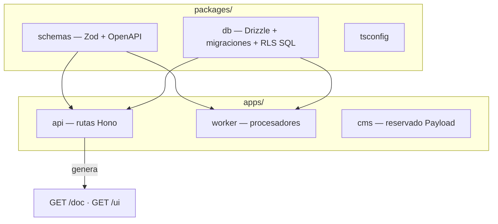

---

## 10. Mapa implementado vs pendiente

Estado al **2026-08-31** según el código en `main`.

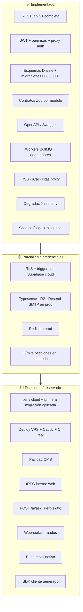

| Próximo paso operativo | Documento |
|------------------------|-----------|
| Completar `.env` y migrar schema | [Migraciones a Supabase](../operations/migrations-supabase.md) |
| Configurar Auth + Google | [Conectar Supabase](../operations/supabase.md) |
| Arrancar en local | [Desarrollo local](../operations/local.md) |
| Plan de producción | [Despliegue](../operations/deploy.md) |

---

## 11. Entorno local vs producción (objetivo)

Hoy el desarrollo usa Docker Compose para Postgres, Redis y Typesense. Producción reparte roles entre VPS y cloud.

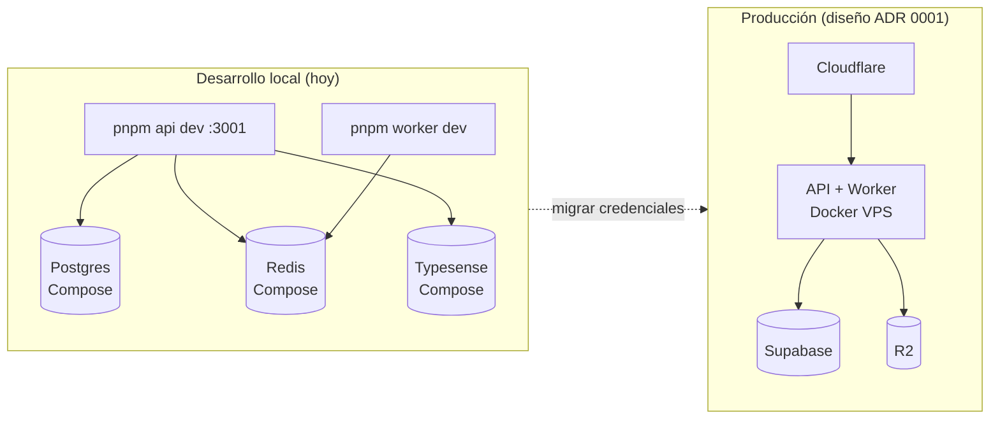

---

## Referencias

- [Visión general](./overview.md)
- [Autenticación](./auth.md)
- [Modelo de datos](./data-model.md)
- [Trabajo asíncrono](./async.md)
- [Referencia de la API](../api/README.md)
- [ADR 0001 — Stack backend](../adr/0001-stack-backend.md)
